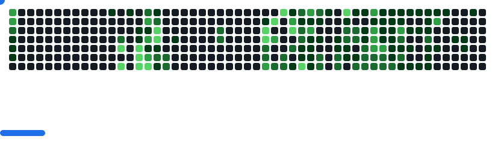

<div style="max-width: 1000px; margin: 0 auto;">

<!-- Top Banner -->
<a href="https://varnitsingh.vercel.app/">
  
</a>

<br/>

<!-- Social Links -->
<div align="right">
  <a href="https://x.com/varnit_singh_" target="_blank">
    
  </a>
  <a href="https://www.linkedin.com/in/varnit-ta/" target="_blank">
    
  </a>
  <a href="https://github.com/varnit-ta" target="_blank">
    
  </a>
</div>


<a href="https://varnitsingh.vercel.app/" target="_blank">
  
</a>

<h3>Backend Developer | Systems & Product Engineering Enthusiast</h3>

- 🔭 Currently working on [VIT Placement Log](https://placementlog.vercel.app)

- 🌱 Exploring **Distributed Systems** and **GoLang**

- 👨‍💻 Check out my projects on [Website](https://varnitsingh.vercel.app/#work)

- 💬 Ask me about **GoLang, typescript**

- 📫 How to reach me **varnitsingh65@gmail.com**

<br/>

<p align="left">

 &ensp; <b> Things I code with</b><br>

[](https://varnitsingh.vercel.app)

</b><br>


<!--START_SECTION:waka-->

```txt
Java                  12 hrs 22 mins  █████████████████████▒░░░   85.00 %
YAML                  1 hr 13 mins    ██░░░░░░░░░░░░░░░░░░░░░░░   08.38 %
JSON                  15 mins         ▒░░░░░░░░░░░░░░░░░░░░░░░░   01.73 %
CSV                   12 mins         ▒░░░░░░░░░░░░░░░░░░░░░░░░   01.46 %
Markdown              11 mins         ▒░░░░░░░░░░░░░░░░░░░░░░░░   01.30 %
```

<!--END_SECTION:waka-->

<div align="center">
  <picture>
    
  </picture>
</div>

<br/>

 &ensp;<b> Stats </b>


<div align=center style="display: flex; flex-direction: col; flex-wrap: wrap; justify-content: center; gap: 10px;">
  <span style="flex: 0 0 350px;"><a href="https://varnitsingh.vercel.app"></a></span>
  
  <span style="flex: 0 0 350px;"><a href="https://varnitsingh.vercel.app"></a></span>
  
  <span style="flex: 0 0 350px;"><a href="https://varnitsingh.vercel.app"></a></span>

  <!-- <span><a href="https://varnitsingh.vercel.app"></a></span> -->
</div>


<br/>

</div>
